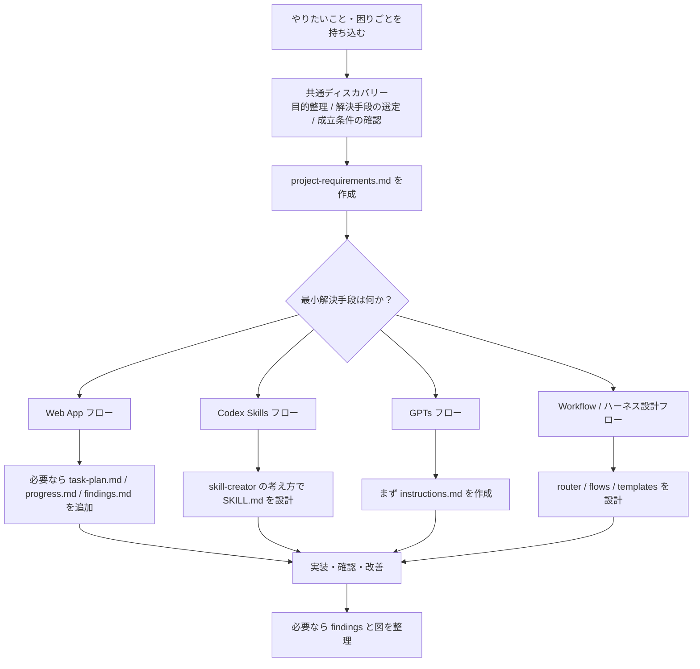
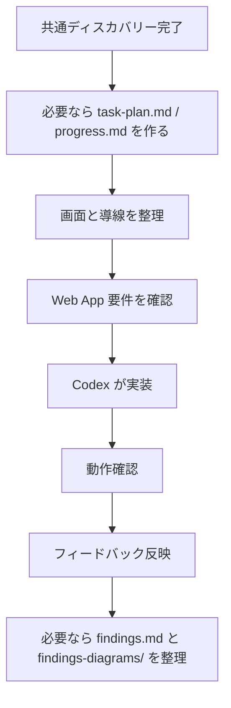
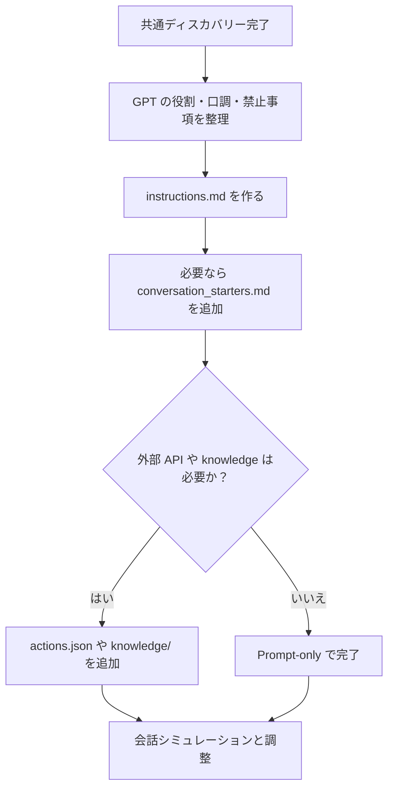
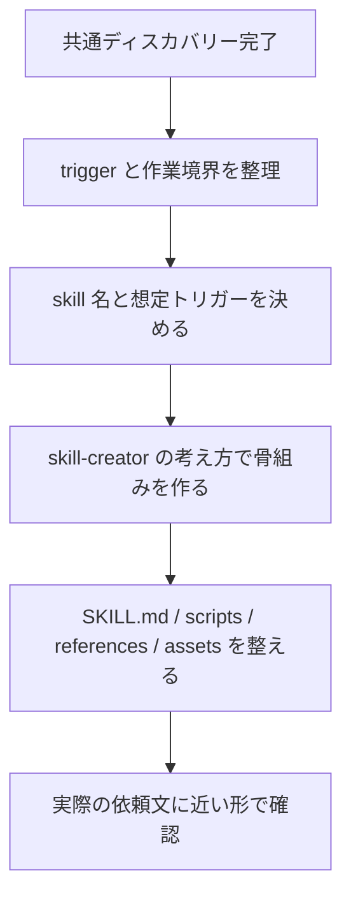

# Ultra Sprint Harness

Codex を使って、非エンジニアでも短時間でプロトタイプを作りやすくするためのハーネスです。

このリポジトリは、いきなり実装に入るのではなく、

1. 何を解くかを短く整理する
2. 何で解くのが最小かを決める
3. その後に適切なフローへ進む

という進め方を前提にしています。

## 何ができるか

このハーネスは、以下の4種類のプロトタイプ作成を想定しています。

| 種別 | 何を作るか | 主な成果物 |
|---|---|---|
| Web App | ブラウザで動くプロトタイプ | ローカルで動く Web アプリ |
| Codex Skills | Codex に新しい能力を足す skill | `SKILL.md` を含む skill フォルダ |
| GPTs | ChatGPT の Custom GPT | `instructions.md` を中心にした prompt パッケージ |
| Workflow / ハーネス設計 | AI への指示フロー自体 | ルーター、フロー定義、テンプレート |

## 初めて使う人向け

最初に覚えることは3つだけです。

1. いきなり作り始めず、まず「何に困っているか」を短く整理する
2. その課題を解く最小手段が `Web App` `Codex Skills` `GPTs` `Workflow` のどれかを決める
3. 決まったフローだけを読んで進める

このリポジトリは、全部を最初から読む前提ではありません。
まず README で全体像をつかみ、次に `discovery.md`、その後に該当フローだけを読む使い方を想定しています。

### 最初の使い方

初回は次の順で進めると迷いません。

1. この README を読む
2. [harness/flows/discovery.md](/Users/ryota/Desktop/エージェント作成/超速スプリント/harness/flows/discovery.md) を読む
3. `projects/{プロジェクト名}/project-requirements.md` を作る
4. [harness/router.md](/Users/ryota/Desktop/エージェント作成/超速スプリント/harness/router.md) を見て最小手段を決める
5. 該当するフロー1つだけを読む
6. 必要なら `task-plan.md` と `progress.md` を追加する

### 何を書き始めればよいか

最初は `project-requirements.md` に次だけ書けば十分です。

- 背景
- 課題
- 期待効果
- 制約
- PoC として何ができれば十分か
- 分からないこと (`TBD`)

完璧に埋める必要はありません。最初は粗くてよく、進めながら更新する前提です。

## 処理の流れ

このハーネスの全体フローは次のとおりです。



### Web App の流れ



### GPTs の流れ



### Codex Skills の流れ



## 基本の進め方

すべての作業は、まず共通ディスカバリーから始めます。

### 1. 共通ディスカバリー

[harness/flows/discovery.md](/Users/ryota/Desktop/エージェント作成/超速スプリント/harness/flows/discovery.md) で、次の3点だけを整理します。

- 目的整理
- 解決手段の選定
- 成立条件の確認

この段階では詳細を詰めすぎません。分からないことは `TBD` として残します。

### 2. ルーティング

[harness/router.md](/Users/ryota/Desktop/エージェント作成/超速スプリント/harness/router.md) で、最小解決手段がどれかを決めます。

- Web App
- Codex Skills
- GPTs
- Workflow / ハーネス設計

### 3. 個別フロー

ルーティング後に、対応するフローへ進みます。

- Web App: [harness/flows/webapp.md](/Users/ryota/Desktop/エージェント作成/超速スプリント/harness/flows/webapp.md)
- Codex Skills: [harness/flows/codex-skills.md](/Users/ryota/Desktop/エージェント作成/超速スプリント/harness/flows/codex-skills.md)
- GPTs: [harness/flows/gpts.md](/Users/ryota/Desktop/エージェント作成/超速スプリント/harness/flows/gpts.md)
- Workflow / ハーネス設計: [harness/flows/harness-design.md](/Users/ryota/Desktop/エージェント作成/超速スプリント/harness/flows/harness-design.md)

## ディレクトリ構成

```text
超速スプリント/
├── README.md
├── CLAUDE.md
├── harness/
│   ├── router.md
│   ├── flows/
│   │   ├── discovery.md
│   │   ├── webapp.md
│   │   ├── codex-skills.md
│   │   ├── gpts.md
│   │   └── harness-design.md
│   └── templates/
│       ├── webapp/
│       ├── codex-skills/
│       ├── gpts/
│       └── harness-design/
└── projects/
```

## `projects/` に何を置くか

各プロジェクトは `projects/{プロジェクト名}/` に作ります。

共通で使うファイルは次のとおりです。

- `project-requirements.md`
  目的、課題、期待効果、制約、PoC 成立条件を書く
- `task-plan.md`
  実装フェーズと現在の作業を残す
- `progress.md`
  実施内容、確認結果、次にやることを残す
- `findings.md`
  調査結果、意思決定、未解決事項を残す
- `findings-diagrams/`
  図で残した方が伝わる内容を置く

単純な依頼では `project-requirements.md` だけで十分です。実装や調査が複雑なときに `planning-with-files` の考え方で他のファイルを追加します。

## 各フローの考え方

### Web App

Web App フローは、共通ディスカバリーで「最小解決手段は Web App」と決まった後に使います。

主な流れは以下です。

1. `task-plan.md` と `progress.md` を必要に応じて作る
2. 画面と導線を整理する
3. Web App 要件を確認する
4. Codex が実装する
5. 動作確認する
6. フィードバックを反映する
7. 必要なら findings と図を整理する

複雑な app や、次スプリントへの引き継ぎが必要な app では `Understand-Anything` を使って構造理解や影響範囲確認を行う想定です。

### Codex Skills

Codex Skills フローは、Codex に新しい能力を追加したい時に使います。

主な成果物は skill フォルダです。

- `SKILL.md`
- 必要なら `agents/openai.yaml`
- 必要なら `scripts/`
- 必要なら `references/`
- 必要なら `assets/`

このフローでは、[$skill-creator](/Users/ryota/.codex/skills/.system/skill-creator/SKILL.md) の考え方を前提にしています。つまり、単発のプロンプトではなく、再利用可能な Codex skill を作るフローです。

### GPTs

GPTs フローは、ChatGPT の Custom GPT を作る時に使います。

基本方針は prompt-first です。まずは `instructions.md` を整えることを優先します。

デフォルトは `Prompt-only` モードです。

- `instructions.md`
- 必要なら `conversation_starters.md`

外部 API や knowledge が必要な場合だけ、`actions.json` や `knowledge/` を追加します。

### Workflow / ハーネス設計

Workflow / ハーネス設計フローは、AI への指示フローそのものを設計したい時に使います。

ルーター、各フロー、テンプレートのようなメタ構造を設計するためのフローです。

## findings と図の扱い

文章だけだと伝わりにくい内容は、`findings-diagrams/` に図として残します。

図に向くものは次の4種類です。

- 画面遷移
- データフロー
- コンポーネント構成
- 改善案の比較図

`mcp_excalidraw` が使える場合は Excalidraw で図を作る想定です。使えない場合は Figma / FigJam または Mermaid を代替として使います。

重要なのは、図は `findings.md` を置き換えるものではないという点です。まず文章で残し、共有効率を上げたい部分だけを図にします。

## 外部の考え方の取り込み

このハーネスは、次の考え方を取り入れています。

### planning-with-files

複雑なタスクでは、重要な情報を会話だけに閉じずファイルへ残す考え方を使います。

このリポジトリでは、次のファイル群に反映しています。

- `project-requirements.md`
- `task-plan.md`
- `progress.md`
- `findings.md`
- `findings-diagrams/`

### Understand-Anything

新規 app の最初から使うというより、実装後または大きくなった app の理解補助として使う位置づけです。

### superpowers

現時点では採用していません。理由は、今のハーネスの対象が非エンジニア向けの軽量プロトタイピングであり、デフォルトとしては少し重いためです。

## このリポジトリの現状

現在は、ハーネス定義とフロー設計が中心です。

- ルーターあり
- 共通ディスカバリーあり
- 4種類の個別フローあり
- templates は空の骨組みのみ
- projects は生成先として確保済み

つまり、実際のプロトタイプを量産する前の「運用ルールと設計方針」が入っている状態です。

## 使い始める時の最短手順

1. 作りたいものの背景、課題、期待効果を整理する
2. `project-requirements.md` に書く
3. 最小解決手段を選ぶ
4. 対応するフローを読む
5. 必要なら `task-plan.md` と `progress.md` を作る
6. 実装または prompt 作成に進む

## 迷った時の判断

- 画面が必要なら、まず `Web App` を疑う
- ChatGPT 上で完結したいなら `GPTs`
- Codex に繰り返し使う能力を足したいなら `Codex Skills`
- 何を作るかより、進め方そのものを設計したいなら `Workflow / ハーネス設計`
- 決め切れない時は、`discovery.md` に戻って「最小手段は何か」をもう一度見る

## 参照ファイル

- [CLAUDE.md](/Users/ryota/Desktop/エージェント作成/超速スプリント/CLAUDE.md)
- [harness/router.md](/Users/ryota/Desktop/エージェント作成/超速スプリント/harness/router.md)
- [harness/flows/discovery.md](/Users/ryota/Desktop/エージェント作成/超速スプリント/harness/flows/discovery.md)
- [harness/flows/webapp.md](/Users/ryota/Desktop/エージェント作成/超速スプリント/harness/flows/webapp.md)
- [harness/flows/codex-skills.md](/Users/ryota/Desktop/エージェント作成/超速スプリント/harness/flows/codex-skills.md)
- [harness/flows/gpts.md](/Users/ryota/Desktop/エージェント作成/超速スプリント/harness/flows/gpts.md)
- [harness/flows/harness-design.md](/Users/ryota/Desktop/エージェント作成/超速スプリント/harness/flows/harness-design.md)
