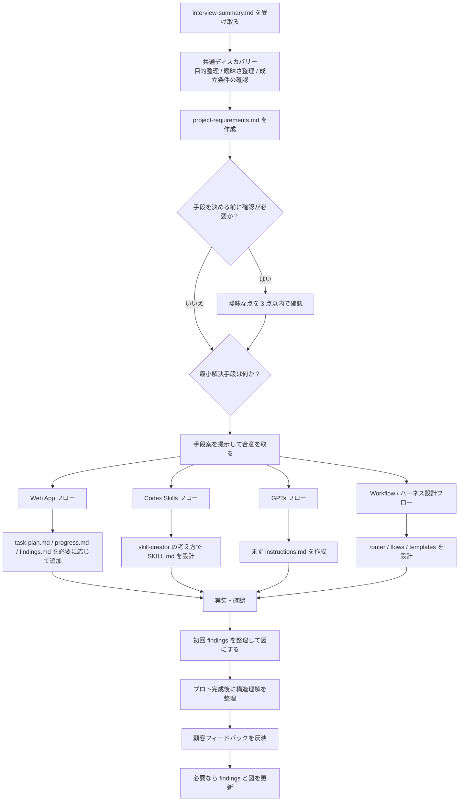
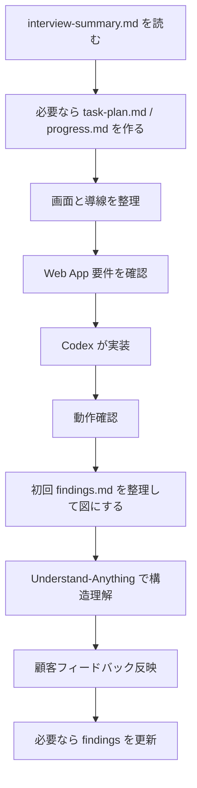
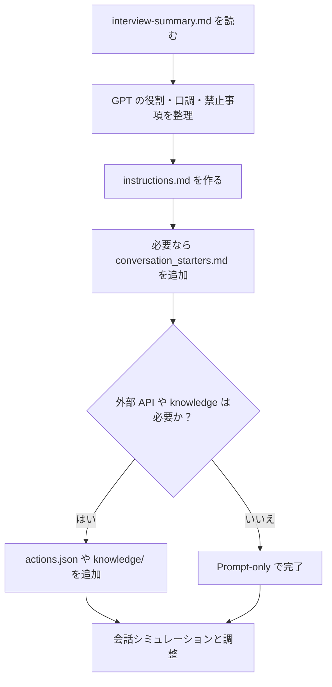
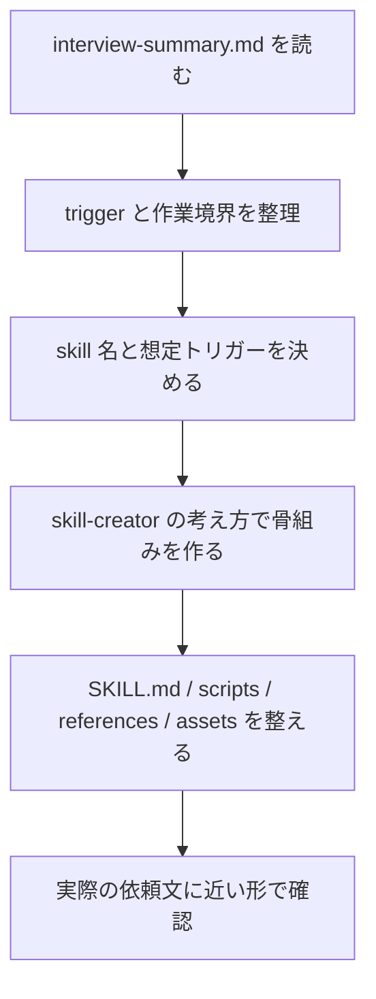

# Ultra Sprint Harness

Codex を使って、非エンジニアでも短時間でプロトタイプを作りやすくするためのハーネスです。

このリポジトリは、いきなり実装に入るのではなく、

1. 何を解くかを短く整理する
2. 何で解くのが最小かを決める
3. 重要な分岐だけユーザーと確認する
4. その後に適切なフローへ進む

という進め方を前提にしています。

実運用では、人に毎回ゼロから質問するより、インタビュー GPTs が要件を簡易的にまとめた md ファイルを入力として受け取ることを想定しています。
ただし `interview-summary.md` は曖昧さを含む前提で扱い、AI が勝手に補完して実装まで突っ走らないようにします。

## 何ができるか

このハーネスは、以下の4種類のプロトタイプ作成を想定しています。

| 種別 | 何を作るか | 主な成果物 |
|---|---|---|
| Web App | ブラウザで動くプロトタイプ | ローカルで動く Web アプリ |
| Codex Skills | Codex に新しい能力を足す skill | `SKILL.md` を含む skill フォルダ |
| GPTs | ChatGPT の Custom GPT | `instructions.md` を中心にした prompt パッケージ |
| Workflow / ハーネス設計 | AI への指示フロー自体 | ルーター、フロー定義、テンプレート |

## 初めて使う人向け

最初に覚えることは3つだけです。

1. いきなり作り始めず、まずインタビュー結果の md を読む
2. その課題を解く最小手段が `Web App` `Codex Skills` `GPTs` `Workflow` のどれかを提案する
3. 重要な曖昧さだけ確認してから、決まったフローだけを読んで進める

このリポジトリは、全部を最初から読む前提ではありません。
まず README で全体像をつかみ、次に `discovery.md`、その後に該当フローだけを読む使い方を想定しています。
実際の入力は `projects/{プロジェクト名}/interview-summary.md` を標準とします。

### 最初の使い方

初回は次の順で進めると迷いません。

1. この README を読む
2. `projects/{プロジェクト名}/interview-summary.md` を用意する
3. [harness/flows/discovery.md](/Users/ryota/Desktop/エージェント作成/超速スプリント/harness/flows/discovery.md) を読む
4. `projects/{プロジェクト名}/project-requirements.md` に理解したことと曖昧な点を書く
5. [harness/router.md](/Users/ryota/Desktop/エージェント作成/超速スプリント/harness/router.md) を見て最小手段を提案する
6. その手段で進めてよいか確認する
7. 該当するフロー1つだけを読む
8. 必要なら `task-plan.md` と `progress.md` を追加する

### 何を書き始めればよいか

最初は `interview-summary.md` と `project-requirements.md` があれば十分です。

`interview-summary.md` には次のような項目が入っていれば使いやすいです。

- 背景
- 現状課題
- 想定ユーザー
- やりたいこと
- 期待効果
- 制約
- 未確定事項

その上で `project-requirements.md` には次だけ書けば十分です。

- 背景
- 課題
- 期待効果
- 制約
- PoC として何ができれば十分か
- 分からないこと (`TBD`)

完璧に埋める必要はありません。最初は粗くてよく、進めながら更新する前提です。

## 処理の流れ

このハーネスの全体フローは次のとおりです。



### Web App の流れ



### GPTs の流れ



### Codex Skills の流れ



## 基本の進め方

すべての作業は、まず共通ディスカバリーから始めます。
デフォルト進行は `checkpointed` で、重要な分岐だけユーザー確認を入れます。

### 1. 共通ディスカバリー

[harness/flows/discovery.md](/Users/ryota/Desktop/エージェント作成/超速スプリント/harness/flows/discovery.md) で、次の3点だけを整理します。

- 目的整理
- 曖昧さの整理
- 成立条件の確認

この段階では詳細を詰めすぎません。分からないことは `TBD` として残します。
ただし、手段の選定や PoC 成立条件に直結する曖昧さは、そのまま流さず短く確認します。

### 2. ルーティング

[harness/router.md](/Users/ryota/Desktop/エージェント作成/超速スプリント/harness/router.md) で、最小解決手段を提案し、ユーザー合意を取ります。

- Web App
- Codex Skills
- GPTs
- Workflow / ハーネス設計

### 3. 個別フロー

ルーティング後に、対応するフローへ進みます。

- Web App: [harness/flows/webapp.md](/Users/ryota/Desktop/エージェント作成/超速スプリント/harness/flows/webapp.md)
- Codex Skills: [harness/flows/codex-skills.md](/Users/ryota/Desktop/エージェント作成/超速スプリント/harness/flows/codex-skills.md)
- GPTs: [harness/flows/gpts.md](/Users/ryota/Desktop/エージェント作成/超速スプリント/harness/flows/gpts.md)
- Workflow / ハーネス設計: [harness/flows/harness-design.md](/Users/ryota/Desktop/エージェント作成/超速スプリント/harness/flows/harness-design.md)

## ディレクトリ構成

```text
超速スプリント/
├── README.md
├── CLAUDE.md
├── harness/
│   ├── router.md
│   ├── flows/
│   │   ├── discovery.md
│   │   ├── webapp.md
│   │   ├── codex-skills.md
│   │   ├── gpts.md
│   │   └── harness-design.md
│   └── templates/
│       ├── webapp/
│       ├── codex-skills/
│       ├── gpts/
│       └── harness-design/
└── projects/
```

## `projects/` に何を置くか

各プロジェクトは `projects/{プロジェクト名}/` に作ります。

共通で使うファイルは次のとおりです。

- `interview-summary.md`
  インタビュー GPTs がまとめた要件サマリー。実運用での標準入力
- `project-requirements.md`
  目的、課題、期待効果、制約、PoC 成立条件を書く
- `task-plan.md`
  実装フェーズと現在の作業を残す
- `progress.md`
  実施内容、確認結果、次にやることを残す
- `findings.md`
  調査結果、意思決定、未解決事項を残す
- `findings-diagrams/`
  図で残した方が伝わる内容を置く

単純な依頼では `interview-summary.md` と `project-requirements.md` だけで十分です。実装や調査が複雑なときに `planning-with-files` の考え方で他のファイルを追加します。

## 各フローの考え方

## 進行モード

このハーネスは次の2つの進め方を想定します。

- `checkpointed`（デフォルト）
  discovery、routing、個別フローの着手前でだけ短く確認する。合意済みスコープの中ではまとめて進める。
- `full-auto`（明示指示時のみ）
  ユーザーが「まず叩き台まで一気に作って」と明示した場合だけ、一気通貫で進める。

通常は `checkpointed` を使う。特に `interview-summary.md` が粗い時は `full-auto` にしない。

### Web App

Web App フローは、共通ディスカバリーで「最小解決手段は Web App」と決まった後に使います。
実際には `interview-summary.md` を読み、その内容を画面と導線に落としていきます。

主な流れは以下です。

1. `task-plan.md` と `progress.md` を必要に応じて作る
2. 画面と導線を整理する
3. Web App 要件を確認する
4. HTML / CSS / JavaScript を中心に Codex が実装する
5. 動作確認する
6. 初回 findings を整理して図にする
7. 初回プロト完成後に構造理解を整理する
8. 顧客フィードバックを反映する

このスプリントでは、初回 findings フェーズで `mcp_excalidraw` を使い、初回プロト完成直後に `Understand-Anything` を使う前提にしています。
API 処理やバックエンド仲介が必要な時だけ Node.js を追加します。
デザインは現行 NTT DATA ブランドを参照した青系テーマを基準にします。

### Codex Skills

Codex Skills フローは、Codex に新しい能力を追加したい時に使います。
実際には `interview-summary.md` から trigger、入力、出力、再利用したい手順を抽出して設計します。

主な流れは以下です。

1. trigger と入出力を整理する
2. スキル設計を確認する
3. Codex が skill を実装する
4. テスト実行する
5. 初回 findings を整理して図にする
6. 初回成果物完成後に構造理解を整理する
7. 顧客フィードバックを反映する

主な成果物は skill フォルダです。

- `SKILL.md`
- 必要なら `agents/openai.yaml`
- 必要なら `scripts/`
- 必要なら `references/`
- 必要なら `assets/`

このフローでは、[$skill-creator](/Users/ryota/.codex/skills/.system/skill-creator/SKILL.md) の考え方を前提にしています。つまり、単発のプロンプトではなく、再利用可能な Codex skill を作るフローです。
このスプリントでは、初回 findings フェーズで `mcp_excalidraw` を使い、初回成果物完成直後に `Understand-Anything` を使う前提にしています。
実装時は `skill-creator` を標準的に使う前提です。

### GPTs

GPTs フローは、ChatGPT の Custom GPT を作る時に使います。
実際には `interview-summary.md` から役割、対象ユーザー、口調、禁止事項を取り出して `instructions.md` に落とします。

基本方針は prompt-first です。まずは `instructions.md` を整えることを優先し、その後のやり取りで system prompt を磨きます。

デフォルトは `Prompt-only` モードです。

- `instructions.md`
- 必要なら `conversation_starters.md`

外部 API や knowledge が必要な場合だけ、`actions.json` や `knowledge/` を追加します。

主な流れは以下です。

1. GPT の役割と禁止事項を整理する
2. GPT 設計を確認する
3. `instructions.md` を中心に成果物を作る
4. テスト用の会話シミュレーションを行う
5. 初回 findings を整理して図にする
6. 初回成果物完成後に構造理解を整理する
7. 顧客フィードバックを反映する

このスプリントでは、初回 findings フェーズで `mcp_excalidraw` を使い、初回成果物完成直後に `Understand-Anything` を使う前提にしています。

### Workflow / ハーネス設計

Workflow / ハーネス設計フローは、AI への指示フローそのものを設計したい時に使います。

ルーター、各フロー、テンプレートのようなメタ構造を設計するためのフローです。

## findings と図の扱い

文章だけだと伝わりにくい内容は、`findings-diagrams/` に図として残します。

図に向くものは次の4種類です。

- 画面遷移
- データフロー
- コンポーネント構成
- 改善案の比較図

このスプリントでは、最初の findings フェーズで `mcp_excalidraw` を使って少なくとも 1 つは図を残す前提にします。使えない場合は Figma / FigJam または Mermaid を代替として使います。

重要なのは、図は `findings.md` を置き換えるものではないという点です。まず文章で残し、共有効率を上げたい部分だけを図にします。

## 外部の考え方の取り込み

このハーネスは、次の考え方を取り入れています。

## 外部 skill / tool の呼び出しルール

このハーネスでは、外部 skill / tool を役割に応じて呼ぶ。
特にこのスプリントでは、`Web App` `Codex Skills` `GPTs` の各フローで `mcp_excalidraw` と `Understand-Anything` に固定の呼び出しタイミングを置く。

### `planning-with-files`

呼ぶタイミング：

- discovery の時点で、作業が 3 ステップ以上になりそう
- checkpoint をまたいで意思決定を残したい
- 実装、調査、確認結果を会話だけに閉じたくない

何をするために呼ぶか：

- `project-requirements.md` に前提と合意事項を残す
- `task-plan.md` に実行フェーズを切る
- `progress.md` に実施内容と確認結果を残す
- `findings.md` に調査結果と判断理由を残す

このハーネスでの位置づけ：

- デフォルトの記録方式
- 複雑さが一定以上なら最初に有効化する
- 単純な依頼では `project-requirements.md` だけでよい

複雑なタスクでは、重要な情報を会話だけに閉じずファイルへ残す考え方を使います。

このリポジトリでは、次のファイル群に反映しています。

- `project-requirements.md`
- `task-plan.md`
- `progress.md`
- `findings.md`
- `findings-diagrams/`

### Understand-Anything

呼ぶタイミング：

- 初回成果物が一度成立した直後
- 顧客フィードバックを反映する前に、構造を把握したい
- 既存成果物に機能追加や修正を入れる前に、影響範囲を知りたい
- 次スプリントや別の人へ引き継ぐために、構造理解を残したい

何をするために呼ぶか：

- コンポーネント、画面、データのつながりを把握する
- 修正時の影響範囲とリスクを洗い出す
- findings に残すための構造理解メモを作る

このハーネスでの位置づけ：

- discovery や route 選定には使わない
- 新規成果物の初期実装前には使わない
- 初回成果物完成直後に一度使う
- その後は改善検討、影響範囲確認、引き継ぎで使う

### `mcp_excalidraw`

呼ぶタイミング：

- 最初の findings フェーズ
- `findings.md` に文章で整理した内容を図にしたい
- 画面遷移、データフロー、コンポーネント構成、改善案比較を共有したい
- 非エンジニア相手に、文章だけだと伝わりにくい

何をするために呼ぶか：

- `findings-diagrams/` 用の図を作る
- レビューや引き継ぎで伝わりやすい可視化を残す

このハーネスでの位置づけ：

- 初回 findings のデフォルト手段
- findings の補助
- discovery や実装そのものの代替ではない
- まず文章、その後に必要な図だけ作る

### superpowers

現時点では採用していません。理由は、今のハーネスの対象が非エンジニア向けの軽量プロトタイピングであり、デフォルトとしては少し重いためです。

## このリポジトリの現状

現在は、ハーネス定義とフロー設計が中心です。

- ルーターあり
- 共通ディスカバリーあり
- 4種類の個別フローあり
- templates は空の骨組みのみ
- projects は生成先として確保済み

つまり、実際のプロトタイプを量産する前の「運用ルールと設計方針」が入っている状態です。

## 使い始める時の最短手順

1. 作りたいものの背景、課題、期待効果を整理する
2. `interview-summary.md` を用意する
3. `project-requirements.md` に整理する
4. 最小解決手段を選ぶ
5. 対応するフローを読む
6. 必要なら `task-plan.md` と `progress.md` を作る
7. 実装または prompt 作成に進む

## 迷った時の判断

- 画面が必要なら、まず `Web App` を疑う
- ChatGPT 上で完結したいなら `GPTs`
- Codex に繰り返し使う能力を足したいなら `Codex Skills`
- 何を作るかより、進め方そのものを設計したいなら `Workflow / ハーネス設計`
- 決め切れない時は、`discovery.md` に戻って「最小手段は何か」をもう一度見る

## 参照ファイル

- [CLAUDE.md](/Users/ryota/Desktop/エージェント作成/超速スプリント/CLAUDE.md)
- [harness/router.md](/Users/ryota/Desktop/エージェント作成/超速スプリント/harness/router.md)
- [harness/flows/discovery.md](/Users/ryota/Desktop/エージェント作成/超速スプリント/harness/flows/discovery.md)
- [harness/flows/webapp.md](/Users/ryota/Desktop/エージェント作成/超速スプリント/harness/flows/webapp.md)
- [harness/flows/codex-skills.md](/Users/ryota/Desktop/エージェント作成/超速スプリント/harness/flows/codex-skills.md)
- [harness/flows/gpts.md](/Users/ryota/Desktop/エージェント作成/超速スプリント/harness/flows/gpts.md)
- [harness/flows/harness-design.md](/Users/ryota/Desktop/エージェント作成/超速スプリント/harness/flows/harness-design.md)
