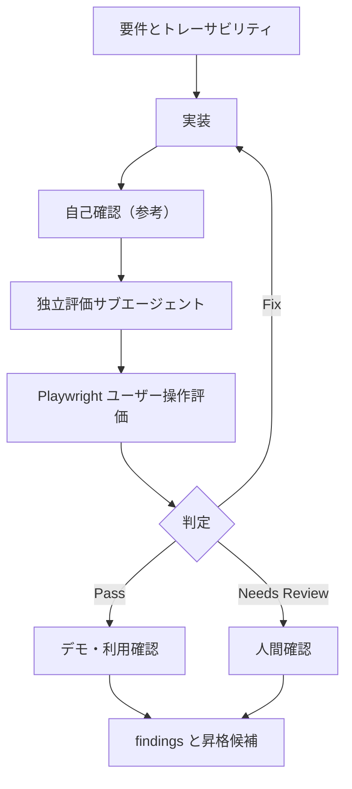

# evaluation-loop.md — 評価ループ記録

> **書くタイミング**: discovery で作成し、自己確認、独立評価、Fix、Needs Review、顧客確認のたびに追記する。
> **目的**: 評価ループの実行順、判断、証跡を Mermaid と表で残し、後から再現・監査できるようにする。

## 現在のループ

## 実行履歴

| 時刻 | iteration / run ID | 実行者 | 操作 | 結果 | 証跡 / 次の動き |
|---|---|---|---|---|---|
| | | 実装担当 / 評価サブエージェント / 人間 | | Pass / Fix / Needs Review | |

> `Needs Review`、または 2 回目の `Fix` を記録した行の後は、自動runを追加しない。人間確認・スコープ再設定後は新しいスプリントとして始める。

## 停止状態

| 項目 | 記録 |
|---|---|
| 現在の判定 | 未開始 / Pass / Fix / Needs Review |
| 停止理由 | |
| 人に確認したいこと | |
