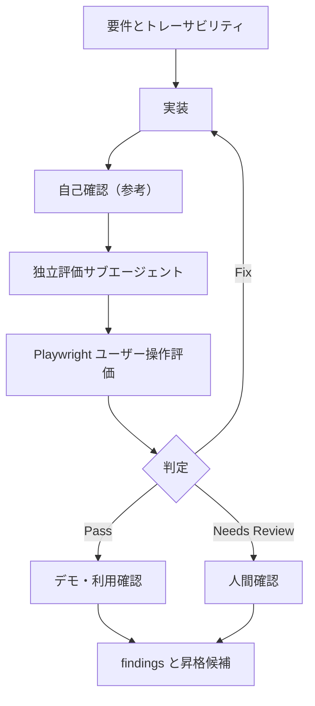

# evaluation-loop.md — 評価ループ記録

## 現在のループ

## 実行履歴

| 時刻 | iteration / run ID | 実行者 | 操作 | 結果 | 証跡 / 次の動き |
|---|---|---|---|---|---|
| 2026-07-14 | iteration-00 | 実装担当 | Playwright による自己確認 | 参考確認: Pass | 正式独立評価は未実施 |

## 停止状態

| 項目 | 記録 |
|---|---|
| 現在の判定 | 参考確認: Pass / 正式評価未実施 |
| 停止理由 | ユーザー依頼への初回構築を優先。独立評価サブエージェントは未実施。 |
| 人に確認したいこと | 実ブランド、商品画像、決済、法務表記を次スプリントで扱うか。 |
