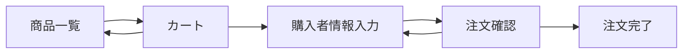

# findings.md

## 初回実装メモ

- 最小スコープは静的 HTML / CSS / JavaScript のフロントプロトタイプ。
- 商品一覧、カート、チェックアウト、注文確認、完了の導線を 1 ページ内の状態遷移で実装。
- 実決済ではないことを画面内に明示し、PoC で高影響操作を扱わないようにした。
- 化粧品 EC としての初期印象を合わせるため、`ui-direction.png` を作成して青系・清潔感・商品訴求の方向性に寄せた。

## 次に確認したいこと

- 実ブランドに合わせる場合の色、ロゴ、商品写真。
- 特定商取引法、返品、配送、成分、広告表現の正式文言。
- 決済、会員、在庫を入れる必要があるか。

## 画面遷移

