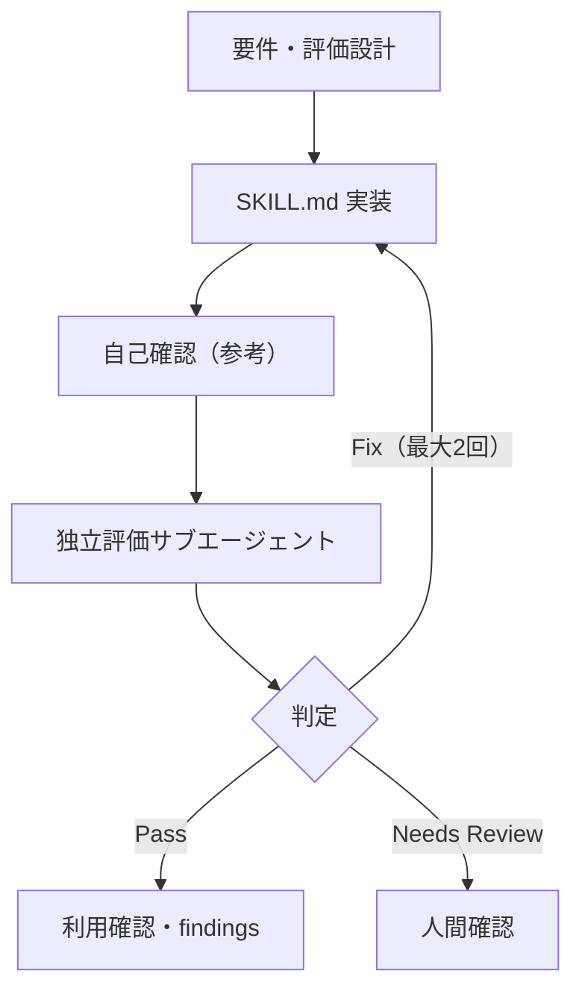

# evaluation loop

| 時刻 | run ID | 実行者 | 操作 | 結果 | 次の動き |
|---|---|---|---|---|---|
| 2026-07-16 | discovery | 実装担当 | 評価設計 | 未判定 | 実装前ゲート |
| 2026-07-16 | 20260716T000000Z-iteration-01 | 独立評価サブエージェント | 形式・通常・短文・危機・反復を評価 | Needs Review | 証跡検査後、人間確認で危機時の所在地不明対応を決める |

| 項目 | 記録 |
|---|---|
| 現在の判定 | Needs Review |
| 停止理由 | 所在地不明の危機入力への初回案内に安全上の不確実性がある |
| 人に確認したいこと | 日本向けスキルとして固定するか、所在地確認後に地域別案内するか |
