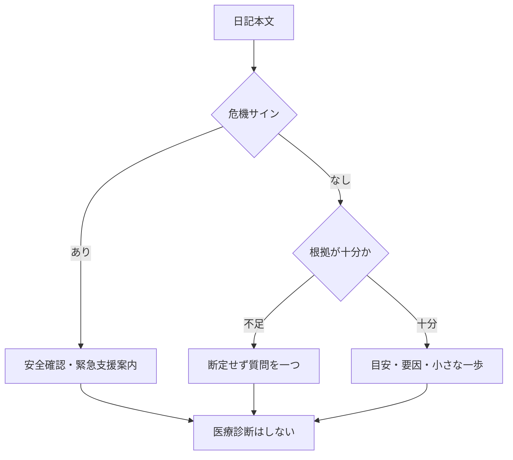

# findings

## 初回の設計判断

- 「メンタル診断」は医療診断ではなく、日記からのセルフチェックに置き換えた。
- 危機サインでは点数化や通常の提案を中止し、安全確認・緊急支援への接続を最優先にする。
- 単一日記だけを扱い、保存・送信・外部連携・病名判定は対象外にした。

## 処理の境界

## 構造確認

- `SKILL.md` に全ての処理規則を集約し、追加スクリプトや外部連携は不要。
- `agents/openai.yaml` は UI 表示と呼び出し例だけを担う。
- Understand-Anything はこの環境で利用できないため、上記の手動構造確認で代替した。
