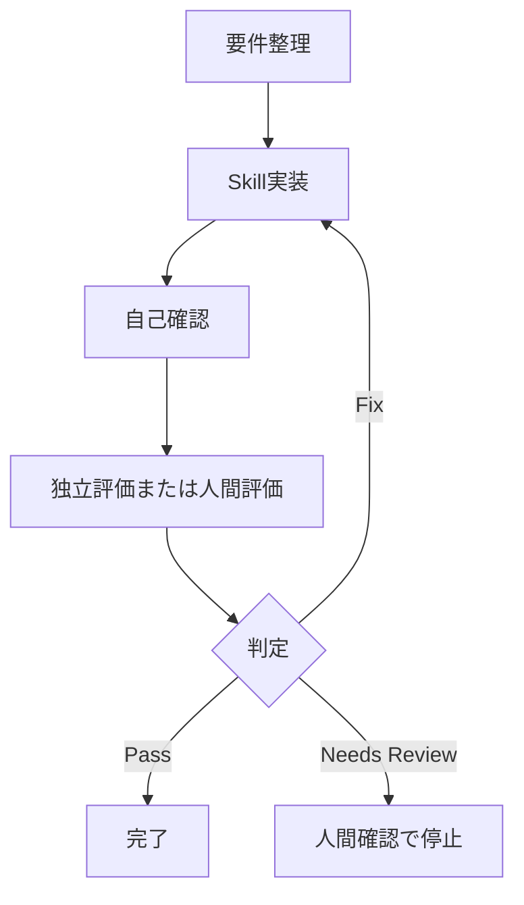

# Evaluation Loop

```mermaid
flowchart TD
  A[要件整理] --> B[Skill実装]
  B --> C[自己確認]
  C --> D[独立評価または人間評価]
  D --> E{判定}
  E -->|Pass| F[完了]
  E -->|Fix| B
  E -->|Needs Review| G[人間確認で停止]
```

## Runs

| Run ID | 判定 | 次の動き |
|---|---|---|
| self-check-20260714 | 自己確認OK | 独立評価またはユーザー実利用フィードバックへ進む |
| 20260715T132218Z-iteration-00 | Pass | 証跡検査後に正式判定として記録する |
