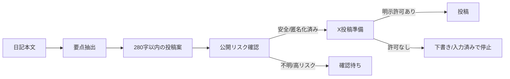

# Findings

## 初回判断

- 最小成果物はCodex Skill。
- X API連携や完全常駐監視はPoC範囲外。
- 投稿は外部公開を伴うため、Skillの標準境界は「投稿案作成」「投稿画面への入力」「明示許可時のみ投稿」。

## 処理フロー

```mermaid
flowchart LR
  A[日記本文] --> B[要点抽出]
  B --> C[280字以内の投稿案]
  C --> D[公開リスク確認]
  D -->|安全/匿名化済み| E[X投稿準備]
  D -->|不明/高リスク| F[確認待ち]
  E -->|明示許可あり| G[投稿]
  E -->|許可なし| H[下書き/入力済みで停止]
```
