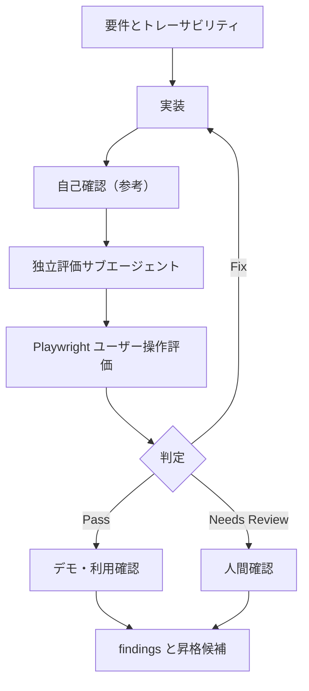

# evaluation-loop.md — 評価ループ記録

## 現在のループ

## 実行履歴

| 時刻 | iteration / run ID | 実行者 | 操作 | 結果 | 証跡 / 次の動き |
|---|---|---|---|---|---|
| 2026-07-16 | discovery | 実装担当 | 要件・評価設計を作成 | 実装前ゲート待ち | Gate Aを通過後に実装 |
| 2026-07-15 | 20260715T151556Z-iteration-00 | 独立評価サブエージェント | PlaywrightでC-01〜C-05、E-01〜E-04を評価 | Pass | faviconの404を自己確認で発見したため修正して再評価 |
| 2026-07-15 | 20260715T152037Z-iteration-01 | 独立評価サブエージェント | Playwright再評価 | Needs Review | 評価時間内にE-02〜E-04を完走できず。自動ループ停止、人間確認へ |

## 停止状態

| 項目 | 記録 |
|---|---|
| 現在の判定 | Needs Review |
| 停止理由 | 独立評価が時間内に完走せず、未確認項目が残ったため |
| 人に確認したいこと | 手動でE-02〜E-04（更新後の再読み込み、空欄送信、優先項目の導線）を確認すること |
