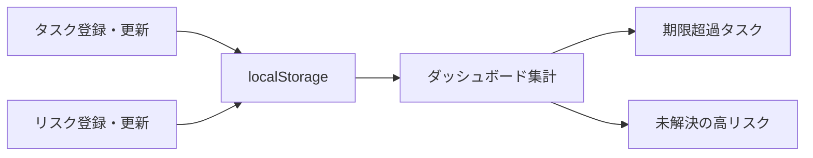

# Findings — Project Pulse

## 初回プロトの構成

- ダッシュボードを起点に、期限超過タスクと未解決の高リスクを別々に優先表示する。
- タスクとリスクは個別画面で登録・編集し、変更は`localStorage`へ保存する。
- ログイン・共有・外部通知はPoC対象外とし、単一ブラウザでの業務判断に絞る。

## データフロー

## 変更時に注意する箇所

- `app.js`の`renderAll()`が一覧と集計を同時に更新するため、新しい状態項目は各レンダリング関数に反映する。
- localStorageのスキーマ変更時は既存データの移行またはリセット方針が必要になる。
- 共有機能を追加する場合は、認証と権限が新たな評価対象になる。
