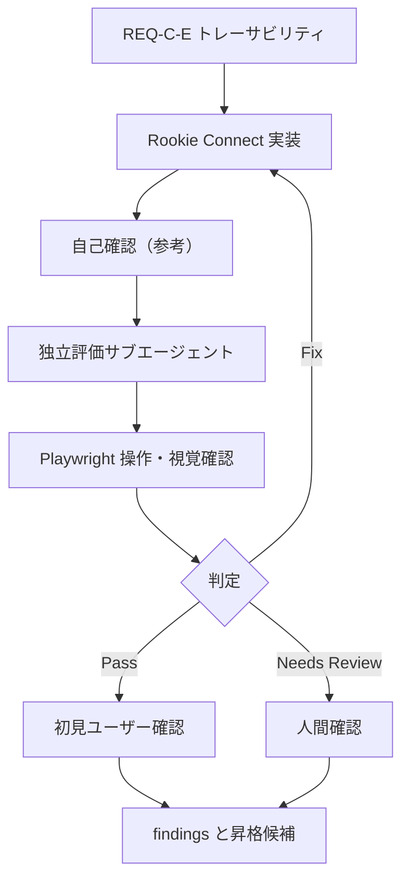

# evaluation-loop.md — Rookie Connect

## 現在のループ

## 実行履歴

| 時刻 | iteration / run ID | 実行者 | 操作 | 結果 | 証跡 / 次の動き |
|---|---|---|---|---|---|
| 2026-07-14 | 20260714T123440Z-iteration-00 | 独立評価サブエージェント | ソース中心の独立評価 | Needs Review | Playwright 未実施のため、新ルールでは参考評価として扱い再評価する |
| 2026-07-14 | 20260714T141053Z-iteration-01 | 独立評価サブエージェント | Playwright による実UI評価 | Fix | E-02 の返信欄が hidden でも表示される。CSS を修正して再評価する |
| 2026-07-14 | 20260714T141335Z-iteration-02 | 独立評価サブエージェント | Playwright 再評価 | Pass | E-02 / C-03 とコンソール確認が Pass。初見ユーザー確認は別の Needs Review として残す |

## 停止状態

| 項目 | 記録 |
|---|---|
| 現在の判定 | Needs Review |
| 停止理由 | 初見ユーザーによる操作発見性の確認が未実施 |
| 人に確認したいこと | 説明なしで投稿、いいね、返信、プロフィールの導線を見つけられるか |
